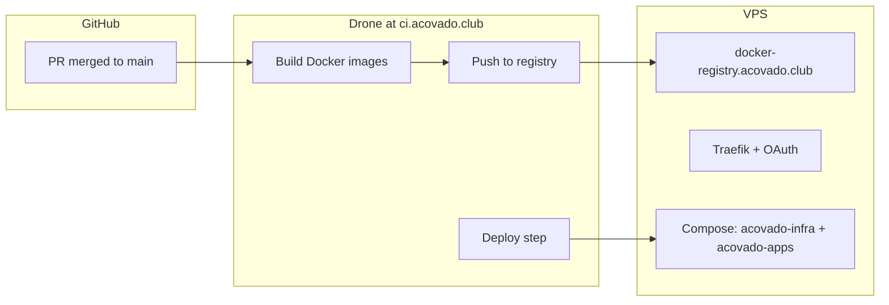

# Deployment (Drone + VPS)

This document describes how **continuous deployment** is wired today: **Drone CI** builds and pushes images to a **private registry**, then **deploys** to the **production VPS** using **Docker Compose** from this repo.

Use it when preparing or executing a deploy (e.g. after merging to `main`).

---

## Architecture (high level)



- **CI**: [Drone](https://ci.acovado.club) runs on **push to `main`** when the pushed commit is a **GitHub merge commit** (see `.drone.yml` `validate-merge-commit`). Feature-branch pushes alone do not run this pipeline.
- **Escape hatch**: To run the full pipeline on a **direct push to `main`** (e.g. fast-forward or cherry-pick) without a PR merge commit, include the literal tag **`[trigger-main-deploy]`** in that commit’s **message**. Use sparingly — it bypasses the merge-commit guard.
- **Registry**: Images are pushed to **`docker-registry.acovado.club`** (`REGISTRY_URL` in `.drone.yml`).
- **CD**: The **deploy** step runs on the **same host** as production (Docker socket mount), from the **checked-out repo** at `/drone/src`, and applies:
  - `config/compose/docker-compose.infra.yaml` → project **`acovado-infra`**
  - `config/compose/docker-compose.apps.yaml` → project **`acovado-apps`**

---

## What the pipeline builds

| Step | Output |
|------|--------|
| `build-example` | `docker-registry.acovado.club/example:${SHA}` |
| `build-signal-processor` | `docker-registry.acovado.club/signal-processor:${SHA}` |
| `build-youtube-worker` | `docker-registry.acovado.club/youtube-worker:${SHA}` |
| `build-reddit-worker` *(pending)* | `docker-registry.acovado.club/reddit-worker:${SHA}` — commented out until `apps/reddit-worker/src/index.ts` exists |
| `build-dashboard` *(pending)* | `docker-registry.acovado.club/dashboard:${SHA}` — commented out until `apps/dashboard` is scaffolded |

All app images are built in parallel from the monorepo `Dockerfile` (`--build-arg APP_PATH=<name>`). `docker-compose.apps.yaml` references all images (`COMMIT_HASH` must match the build).

---

## What the deploy step does

Defined in `.drone.yml` under **`deploy`**:

1. **`cd "${DRONE_WORKSPACE:-/drone/src}"`** — compose **`extends:`** and **RabbitMQ build context** must resolve from the repo root.
2. **`cp -rf infra /srv/volumes/deployment`** — observability configs (ClickHouse, Signoz, OTel collector files) are read from **`${CONFIG_FILES_ROOT}/infra/...`** on the host, with **`CONFIG_FILES_ROOT=/srv/volumes/deployment`**.
3. **`docker compose -f config/compose/docker-compose.infra.yaml -p acovado-infra up -d`**
4. **`docker compose -f config/compose/docker-compose.apps.yaml -p acovado-apps up -d --force-recreate`**

Host paths mounted into the deploy step:

| Mount | Purpose |
|-------|---------|
| `/var/run/docker.sock` | Run Docker on the host |
| `/srv/env` | `ENV_FILES_ROOT` — `*.env` for compose `env_file` |
| `/srv/volumes` | `VOLUMES_ROOT` — Postgres, Signoz, Falkor, Ollama, Portainer data, etc. |

Environment passed to compose (see `.drone.yml`): **`COMMIT_HASH`**, **`REGISTRY_URL`**, **`VOLUMES_ROOT`**, **`CONFIG_FILES_ROOT`**, **`ENV_FILES_ROOT`**.

---

## VPS layout (operational)

These are **not** in the monorepo compose files but run on the server and are required for TLS, CI, and registry:

| Path / piece | Role |
|--------------|------|
| `/srv/traefik` | Traefik (`proxy`) + Google OAuth (`oauth2-proxy`), **`proxy-network`** |
| `/srv/drone` | Drone server + Docker runner |
| `/srv/docker-registry` | Registry + UI (push/pull for CI and nodes) |

Shared Docker networks (used by Traefik and compose stacks):

- **`proxy-network`** — external, for HTTPS routes (Signoz, RabbitMQ UI, stats, etc.).
- **`internal-network`** — external, for app ↔ infra (Postgres, OTel, `example`, …).

Env files live under **`/srv/env/`**. Required files:

| File | Who populates |
|------|--------------|
| `postgres.env` | `prepare-vps-for-cd.sh` (stub; change in prod) |
| `rabbitmq.env` | `prepare-vps-for-cd.sh` (auto-random password) |
| `falkordb.env` | `prepare-vps-for-cd.sh` (auto-random password) |
| `example.env` | `prepare-vps-for-cd.sh` (stub) |
| `signal-processor.env` | `prepare-vps-for-cd.sh` (stub — operator must fill DB/AMQP creds) |
| `youtube-worker.env` | `prepare-vps-for-cd.sh` (stub — operator must fill DB/AMQP creds) |
| `reddit-worker.env` | `prepare-vps-for-cd.sh` (stub — **operator must fill Reddit API credentials**) |
| `dashboard.env` | `prepare-vps-for-cd.sh` (stub — operator must fill DB creds) |

See `config/deploy/env-templates/` for the full required-vars list per service. Do not commit real production secrets; keep them on the host.

Persistent data under **`/srv/volumes/`** (e.g. `postgres-data`, `signoz-*`, `falkordb-data`, `stats` for Portainer).

---

## One-time host preparation

Before the **first** successful deploy from the current repo layout (Signoz, `example` app, etc.), the host may need:

- Networks and volume directories
- Legacy containers removed (old Metabase/Tempo/old collector) so names and ports do not conflict
- **`example.env`** and any missing service env files

The repo includes **`config/deploy/prepare-vps-for-cd.sh`** for that purpose (run as root on the VPS). It is idempotent where safe and does **not** overwrite a non-empty `postgres.env` / `rabbitmq.env`.

```bash
# On the VPS (after copying the script or cloning the repo):
sudo bash config/deploy/prepare-vps-for-cd.sh
```

---

## Application workload (current repo)

**Apps compose** (`config/compose/docker-compose.apps.yaml`) runs these services:

| Container | Image | Env file | Notes |
|-----------|-------|----------|-------|
| `example` | `${REGISTRY_URL}/example:${COMMIT_HASH}` | `example.env` | Scaffold / health probe |
| `signal-processor` | `${REGISTRY_URL}/signal-processor:${COMMIT_HASH}` | `signal-processor.env` | AMQP consumer; Reddit + YouTube signal extraction |
| `youtube-worker` | `${REGISTRY_URL}/youtube-worker:${COMMIT_HASH}` | `youtube-worker.env` | YouTube RSS poller |
| `reddit-worker` | `${REGISTRY_URL}/reddit-worker:${COMMIT_HASH}` | `reddit-worker.env` | Reddit poller — **image build pending** (`src/index.ts` missing) |
| `dashboard` | `${REGISTRY_URL}/dashboard:${COMMIT_HASH}` | `dashboard.env` | REST API + Traefik ingress — **app not yet scaffolded** |

All pipeline services connect to `internal-network`; `dashboard` additionally joins `proxy-network` for Traefik TLS ingress at `dashboard.acovado.club`.

- **Infra compose** includes Postgres, RabbitMQ (custom image build), **Signoz** (ClickHouse, collector, …), FalkorDB, **Portainer** (`stats` → **`stats.acovado.club`** behind Traefik), etc. See `config/compose/docker-compose.infra.yaml`. (Ollama / `inference-model` is not deployed in prod; use `infra/inference-model` locally if needed.)

---

## Release / changelog (optional)

If the **`release-versions`** step runs (pending changesets), it may commit version bumps and tags. That step is separate from image deploy; coordinate with your changesets workflow.

---

## Checklist for the next deploy session

1. **Branch** contains the latest **`.drone.yml`** and **`config/compose/**`** you expect.
2. **VPS**: Traefik + Drone + registry are up; **`/srv/env`** has the needed `*.env` files; **`prepare-vps-for-cd.sh`** already run if this is the first greenfield deploy.
3. **Merge to `main` via GitHub PR** (so the merge commit exists → Drone runs), **or** push to `main` with **`[trigger-main-deploy]`** in the commit message (escape hatch).
4. **Watch** [ci.acovado.club](https://ci.acovado.club): build → push → **deploy** green.
5. **Smoke test**: `example` healthy path (internal or via future ingress), **`stats.acovado.club`** once **`stats`** is up, Signoz UI if exposed.

---

## Troubleshooting (quick)

| Symptom | Where to look |
|---------|----------------|
| Pipeline skipped | Push not to `main`, or commit not a **merge commit** and message lacks **`[trigger-main-deploy]`** |
| Build/push fails | Registry auth, disk space, Dockerfile |
| Deploy fails | `docker compose` cwd (must be repo root — fixed in `.drone.yml`), missing **`/srv/env`** file, **`CONFIG_FILES_ROOT`** paths after `cp infra`, network names, **OOM** (Signoz/ClickHouse are heavy) |
| `stats.acovado.club` down | **`stats`** container not running — ensure **`acovado-infra`** deploy succeeded |

---

## Related files

| File | Purpose |
|------|---------|
| `.drone.yml` | Full pipeline (build, deploy, cleanup, release) |
| `Dockerfile` | Monorepo `bun install`, then app runs `bun run src/index.ts` (JIT workspace modules) |
| `config/compose/docker-compose.infra.yaml` | Production infra stack |
| `config/compose/docker-compose.apps.yaml` | Production app(s) |
| `config/deploy/prepare-vps-for-cd.sh` | Host prep before first aligned deploy |
